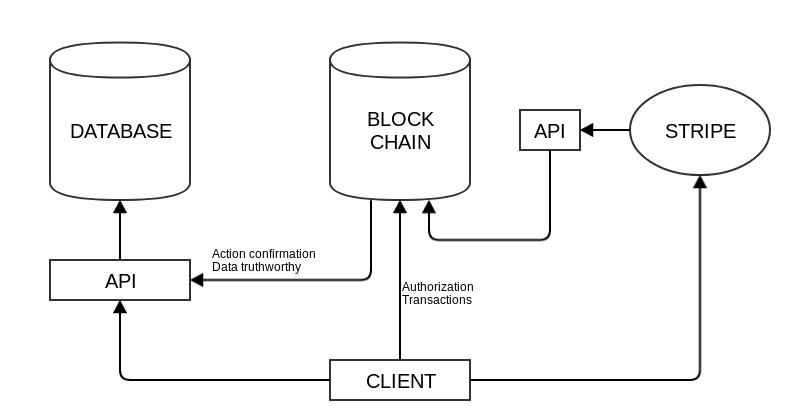
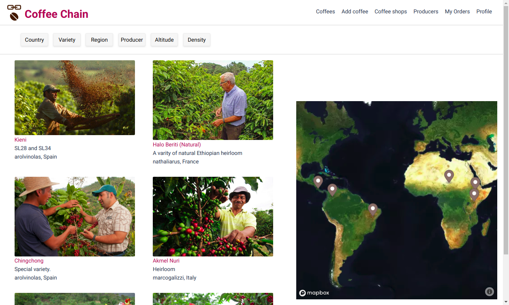
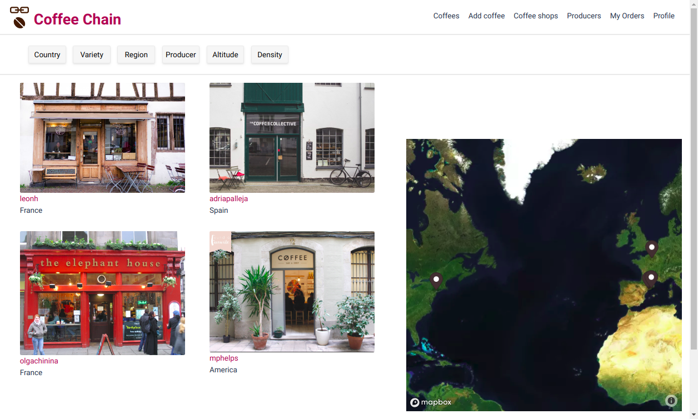
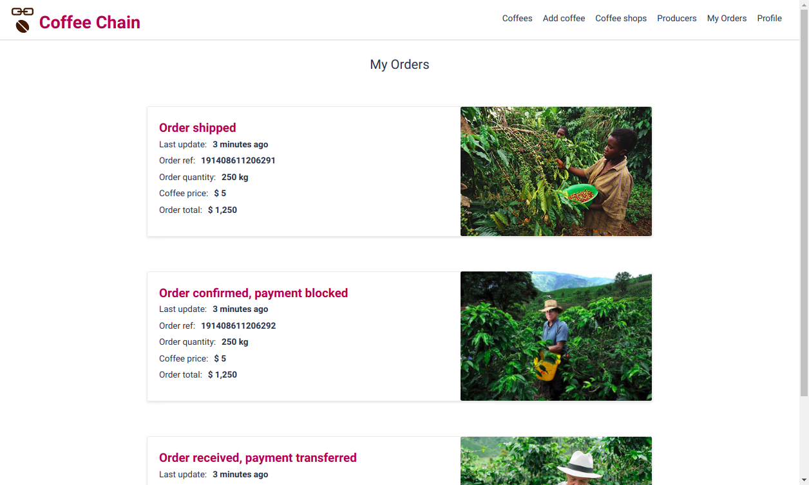

# Coffeechain

## Contents

* [What is it?](https://github.com/leonhfr/coffee-blockchain-backend#what-is-it)
* [Tech stack](https://github.com/leonhfr/coffee-blockchain-backend#tech-stack)
* [How does it work?](https://github.com/leonhfr/coffee-blockchain-backend#how-does-it-work)
* [Screenshots and details](https://github.com/leonhfr/coffee-blockchain-backend#screenshots-and-details)
* [Getting started](https://github.com/leonhfr/coffee-blockchain-backend#getting-started)
  * [Prerequisites](https://github.com/leonhfr/coffee-blockchain-backend#prerequisites)
  * [Run the dApp](https://github.com/leonhfr/coffee-blockchain-backend#run-the-dapp)
  * [Troubleshooting](https://github.com/leonhfr/coffee-blockchain-backend#troubleshooting)
  * [Stop the dApp](https://github.com/leonhfr/coffee-blockchain-backend#stop-the-dapp)
  * [Useful stuff](https://github.com/leonhfr/coffee-blockchain-backend#useful-stuff)
* [Future features](https://github.com/leonhfr/coffee-blockchain-backend#future-features)
* [Authors](https://github.com/leonhfr/coffee-blockchain-backend#authors)

## What is it?

> When I speak about it in the West, people say they trust Google, Facebook, or their banks. But the rest of the world doesn't trust organizations and corporations that much — I mean Africa, India, the Eastern Europe, or Russia. It’s not about the places where people are really rich. Blockchain's opportunities are the highest in the countries that haven’t reached that level yet. - Vitalik Buterin, inventor of Ethereum

Coffeechain aims to connect specialty coffee producers and coffee shops and support direct and fair trade. It is a decentralized market place providing a trustless system with blockchain. Intermediaries are removed and no third party is involved.

## Tech Stack

Blockchain:
* [EOS](https://eos.io/)

Back-end:
* [Koa](https://koajs.com/)
* [MySQL](https://www.mysql.com/)
* [Sequelize](http://docs.sequelizejs.com/)
* [Redis](https://redis.io/)
* [Demux](https://github.com/EOSIO/demux-js)
* [Stripe](https://stripe.com/)

Front-end:
* [React](https://reactjs.org/)
* [Redux](https://redux.js.org/)
* [Emotion](https://emotion.sh/)
* [Mapbox](https://www.mapbox.com/)
* [Stripe](https://stripe.com/)

## How does it work?

<p align="center">
  
</p>

In this project, the blockchain is used as the **single source of truth**.

We are building on EOS. EOS is a blockchain that acts like a decentralized operating system. It specializes in smart contracts and allows very high performance and throughput of several millions of transactions per second with no transaction fees.

We are deploying a smart contract called **beancoin**. The smart contract acts like a normal contract but does not need any third party. It is autonomous and self-enforcing. Beancoin oversees the interactions between producers and customers. It is public, so that everyone knows by which rules to abide.

The state of the smart contracts is stored in the blockchain: users, the coffees available and the sales that have been made and their status. The problem is that blockchain is good for trustless decentralized systems, but that it is expensive to store data in it and hard to query like you would with a traditional API.

In this project, when a user sends data, it is stored in the database. A md5 hash of the data is sent to the blockchain. If the hash of the data stored in the blockchain matches the hash of the data sent to the database, we know that the query is trustworthy and that the user authorized it. The data is then served back to the user via a traditional API that allows complex queries. Conversely, the user can also query the blockchain to verify that the hashes match the data it received from the database.


## Screenshots and details

#### All available coffees

<p align="center">
  
</p>

---

#### Coffee shops

<p align="center">
  
</p>

---

#### My orders

<p align="center">
  
</p>

## Getting started

### Prerequisites

* Either **Ubuntu 18.04** or **MacOS Darwin** or higher. Other operating systems will **not** work, sorry.
* [Docker](https://docs.docker.com/install/linux/docker-ce/ubuntu/)
* [Node.js](https://nodejs.org/en/download/package-manager/#debian-and-ubuntu-based-linux-distributions)
* You will also need the [Coffeechain client](https://github.com/chinins/coffee-chain-frontend) if you want any sort of useful interaction with the application.

### Run the dApp

With default settings, the dApp, eosio, redis and MySQL will occupy the ports 3306, 4000, 5555, 6379 and 7777. Make sure nothing else is running on these ports or change them when creating the `.env` file.

1. First, clone the repository and create a `.env` file as shown in `.env.example`:
```shell
git clone https://github.com/leonhfr/coffee-blockchain-backend
cd coffee-blockchain-backend
cp .env.example .env
# Atom or your favorite editor:
atom .env
# Adjust variables.
# Save the file.
```
2. Then, run the script `blockchain.sh`: `sh blockchain.sh`

The above script will:
* Check that you have Docker and Node.js installed
* Install backend dependencies (`npm install`)
* Pull a redis image and start it
* Pull a MySQL image and start it
* Pull an eosio/eos image and start it
* Start a private EOS blockchain and configure it
* Deploy the `beancoin` smart contract
* Populate the database and the blockchain with mock data
* Start the backend API server (`npm start`)

### Troubleshooting
* Docker needs to be able to run [without sudo](https://docs.docker.com/install/linux/linux-postinstall/).
* You may need to make the scripts executable. Run this command from the `coffee-blockchain-backend` directory:
```sh
chmod +x blockchain.sh \
  ./blockchain/scripts/redis.sh \
  ./blockchain/scripts/mysql.sh \
  ./blockchain/scripts/eosio.config.sh \
  ./blockchain/scripts/eosio.data.sh \
  ./blockchain/scripts/eosio.start.sh
```

### Stop the dApp

In the terminal, press `ctrl+c` on your keyboard. Then run: `sh blockchain.sh stop`

You can check with `docker ps` whether some containers are still running.

### Useful stuff

The backend and the frontend are already configured to interact with the blockchain. However, should you wish to interact with it directly, the easiest way is to alias the `docker exec` command to avoid having to enter the Docker containers' bashes every time.

```shell
# For MySQL:
alias sqlcoffee='docker exec -it mysql_coffeechain mysql -u root --password=[your DB_PASS from .env]'
# For the eosis/eos image:
alias cleos='docker exec -it eosio_coffeechain /opt/eosio/bin/cleos --url http://127.0.0.1:7777 --wallet-url http://127.0.0.1:5555'
```

Please note that the aliases will only be valid within your current terminal. To save them permanently add them to your `~/.bash_profile`.

For interacting with **cleos**, the `blockchain.sh` script saves the password of the `eosiomain` and `beancoin` wallets to the folder `/blockchain/data`, you may need them to unlock the wallets. You should also take a look at the mock keys in `/blockchain/scripts/mock.data.user.json`.

## Future features

* Authentication using [Scatter](https://get-scatter.com/)
* Payments via a decentralized network like [EOS](https://eos.io/) or [Stellar](https://www.stellar.org/)
* Shipping
* Reviews
* messaging

## Authors

* Olga Chinina - [Github](https://github.com/chinins)
* Marco Galizzi - [Github](https://github.com/Tezenn) - [LinkedIn](https://www.linkedin.com/in/marco-galizzi-8084a5173/)
* Léon Hollender - [Github](https://github.com/leonhfr) - [LinkedIn](https://www.linkedin.com/in/leonhollender/)
* Adria Palleja - [Github](https://github.com/adriapalleja) - [LinkedIn](https://www.linkedin.com/in/adri%C3%A0-pallej%C3%A0-3876a186/)
* Nathalia Rus - [Github](https://github.com/nathaliarus)
