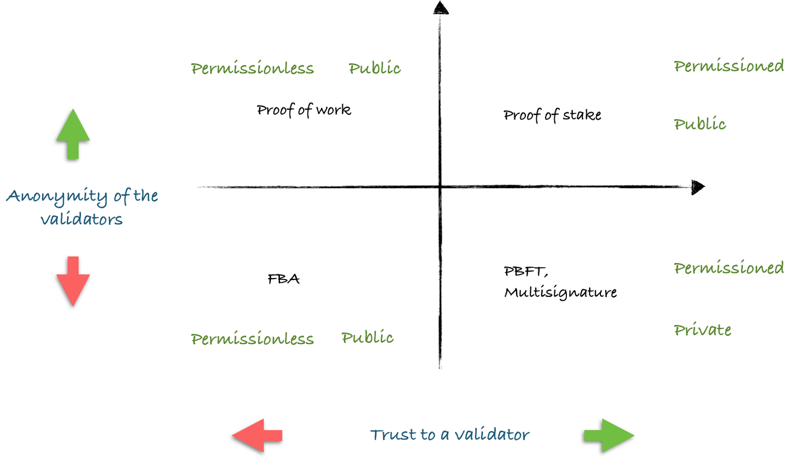
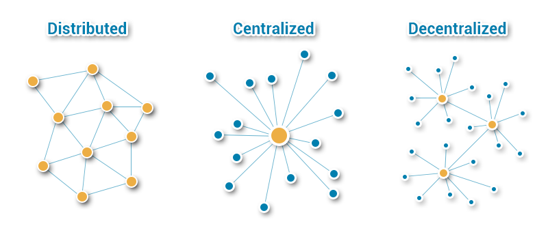

# Comparison of Blockchains Technologies

## Concepts

### Blockchain

Blockchain, defined broadly, is a mechanism for reaching consensus regarding the state of a shared database between multiple parties who don't trust each other.

### Coin

A **cryptocurrency** can be:

- a real decentralized cryptocurrency like Bitcoin
- a crypto-asset, backed by something or somebody (IOU in Ripple)
- a random coin, backed by nothing and pre-mined by the creator (aka a scam)

### Model

Two criteria matter when it comes to definition of an environment and a blockchain:

1. level of anonymity of validators (i.e. do we know their identity?)
2. level of trust in validators (i.e. how inevitable is punishment for misbehavior?)

#### Features

| Quadrant         | Top-left           | Top-right      | Bottom-left        | Bottom-right              |
| ---------------- | ------------------ | -------------- | ------------------ | ------------------------- |
| **Type**         | Public             | Public         | Public             | Private                   |
| **Openness**     | Permissionless [1] | Permissioned   | Permissionless [2] | Permissioned              |
| **Consensus**    | PoW                | PoS            | FBA                | PBFT / Multisignature [3] |
| **Anonymity**    | High               | High           | Moderate           | Low                       |
| **Immutability** | High               | Moderate       | Moderate           | Low [4]                   |
| **Scalability**  | Low                | Moderate       | Moderate           | High                      |
| **Trust level**  | Very low [5]       | High [6]       | Low [7]            | High [8]                  |
| **Examples**     | Bitcoin, Monero    | Bitshares, EOS | Ripple, Stellar    | IBM Hyperledger           |

1. One doesn't need to be previously vetted in order to participate in the consensus process
2. Under certain social agreement anybody who qualifies can become a validator
3. Fast consensus algorithm based on high trust to a validator
4. Really only depends on agreement between validators
5. No punishment for attacking the system
6. Loss of security deposit in case of an attack on the system with double spending attempt
7. Even though identities are low, validators have almost nothing to lose
8. Misbehavior results in lost license or membership

#### Suitable for

- **Top-left:** Fully autonomous systems, totally out of government control  
- **Top-right:** Community governance, execution of contracts, private money systems  
- **Bottom-left:** National and consortium blockchains  
- **Bottom-right:** Banking, fast payment infrastructure, corporate usage  

#### Future

- **Top-left:** Drift to full anonymity and decentralization of mining
- **Top-right:** Improve reputation models via security deposits and an election mechanism, tend to evolve into slightly decentralized (dozens of very powerful nodes) but relatively fast and federated network
- **Bottom-left:** Will be used to build national or multi-national blockchains
- **Bottom-right:** Corporate systems, the word "blockchain" isn't really a selling point, traceability, flexibility, efficient governance and crypto-API for digital assets

### Public & Private Blockchains

|                         | Public                                        | Private                                                 |
| ----------------------- | --------------------------------------------- | ------------------------------------------------------- |
| **Permission**          | Permissionless Open read Open write | Permissioned Closed write Open or closed read |
| **Consensus Mechanism** | Proof of work, proof of stake, etc...         | Pre-approved actors within organization                 |
| **Speed**               | Slower                                        | Faster                                                  |
| **Identity**            | Pseudonymous, anonymous                       | Known                                                   |

#### Similarities

- Both are decentralized peer-to-peer networks, where each participant maintains a replica of a shared append-only ledger of digitally signed transactions
- Both maintains the replicas in sync through a protocol referred to as a consensus
- Both provide certain guarantees on the immutability of the ledger, even when some participants are faulty or malicious

#### Difference

**Who is allowed to participate in the network, execute the _consensus_ protocol and maintain the shared ledger?**

#### Public blockchain

- Completely open, anyone can join and participate in the network
- Substantial amount of computational power is required for the mining process (Proof of Work)
- No privacy for transactions
- No one body has control over the network
- Their transparency makes them very secure (security-via-openness), because they can be audited by anybody, it is easy to detect fraud on the chain
- Each node has as much transmission/auditing power as any other
- Before a transaction is considered valid, it must be authorized by each of its constituent node via the chain's consensus process
- Not only decentralized, but _distributed_
- Expensive in terms of money, time and energy

#### Private blockchain

- Requires an invitation and must be validated by either the network starter or a set of rules put in place by the network starter, notion of _permissioned_ network
- Operates like a centralized database system that limits access to certain users
- Once an entity has joined the network, it will play a role in maintaining the blockchain in a decentralized manner
- Not necessarily decentralized or distributed
- Their strong cryptography and auditability offer more security than traditional methods
- More efficient in money, time and energy
- Strong ability to manage read and write permissions
- Benefits within an organization are increased efficiency and cost reduction
- Read permissions may be private or public, depending on the use case

#### Choice

- Concerns over privacy will continue to be an issue due to the transparent nature of blockchain
- Private blockchains have a speed and cost advantage
- As public blockchains introduce privacy measures, it will render most today's private chains obsolete

### Considerations

[Blockstacks to build a decentralized application that scales](https://hackernoon.com/how-to-build-a-decentralized-application-that-scales-try-less-blockchain-b3e61b1d7bd6)

[Ok, I need a blockchain, but which one?](https://medium.com/@pavelkravchenko/ok-i-need-a-blockchain-but-which-one-ca75c1e2100)

[Does a blockchain really need a native coin?](https://medium.com/@pavelkravchenko/does-a-blockchain-really-need-a-native-coin-f6a5ff2a13a3)

[Does this "cool project" truly need blockchain?](https://medium.com/@pavelkravchenko/investor-guide-does-this-cool-project-truly-need-blockchain-bdde70a26bfb)

## IBM Hyperledger

- Private Network: read/write are permissioned
- No built-in cryptocurrency
- Can create custom tokens via chaincode
- No mining: pluggable consensus algorithm, PBFT (Practical Byzantine Fault Tolerance)
- Chaincode usually written in Golang
- Transaction doesn't have to be paid

### Links

[How to set up a distributed network of peer nodes?](https://stackoverflow.com/questions/44842660/hyperledger-fabric-how-to-set-up-a-distributed-network-of-peer-nodes)

## Stellar

## Lisk

https://lisk.io/

https://github.com/LiskHQ

### Concepts

- Application, provides the interface for everyone to access the dynamic nature of your custom sidechain. Once connected to the sidechain, applications can exchange data with Lisk's mainchain
- Sidechain, a personal blockchain that can be easily built and customized, will house data of the dapp
- Mainchain: hosts the LSK currency and is the hub for sidechains
- **Delegated Proof of Stake**
- **Transaction fee of 0.1 LSK (~ $0.35)**

### Links

[Lisk Protocol](https://lisk.io/documentation/lisk-protocol)

[Lisk Academy](https://lisk.io/academy/welcome-to-the-lisk-academy)

[Voting Explained](https://www.reddit.com/r/Lisk/comments/6wsb9x/voting_explained/)

## EOS

https://eos.io/

https://cryptobriefing.com/eos-ethereum-smart-contract-war-winner/

### Characteristics

- Increased stability
- High throughput
- Cost efficiency (elimination of charges)
- Fast, easy dApp deployment process
- Role-base permission management
- Low latency, provides all users with feedback with a delay no longer than several seconds
- Cryptocurrency
- Parallel processing (faster transaction speed, more scalable)
- Constitution, i.e. a set of rules everyone agree to, linked to each block mined
- Fixed annual inflation of 5% used to pay the server resources

### Smart Contracts

- Structure for obligations between the participants in order to process financial transactions
- Once registered, they are executed on nodes by applying general contract rules and requirements
- The records (legal transfers and moves) are transparently stored on the blockchain
- Smart contract defines:
  - a set of obligations
  - parameters
  - required actions
  - an information structure
  - an interface code
- **Requires C/C++ experience**
- Requires command line and Linux experience

### Decentralized Operating System

- Developers can build applications on EOS
- Owning EOS coins is a claim on server resources (necessity to own EOS to use it)
- Developers do not spend coins to use server resources, the only necessity is proving you own them
- Block rewards in EOS are the incentives for the servers to host EOS applications
- Applications have their own secure database and file space on EOS
- EOS allow developers to create blockchain applications with which users will easily interact with
- ERC20 like tokens can be created on EOS, this means that ICOS can be hosted on this blockchain

### Conclusion

Supports high-scale applications, erases transaction fees, can execute millions of operations per second

However, knowledge of C/C++ is required so it may not be an option

### Links

https://medium.com/applicature/eos-smart-contract-development-a62c66e8faac

https://medium.com/coinmonks/how-to-create-an-eos-dapp-simple-guide-ddc1e9d05cb2

https://medium.com/infinitexlabs/the-ultimate-end-to-end-eos-dapp-development-tutorial-part-1-2f99c512086c

https://infinitexlabs.com/eos-development-tutorial-part-2/

https://github.com/infiniteXLabs/Oasis

## Ethereum

- Public Network: read/write access to all peers
- Built-in cryptocurrency: ether
- Can create custom tokens via Coin API
- Consensus is reached by mining: Proof of Work (soon to be proof of stake)
- Smart contract usually written in Solidity
- A transaction fee must be paid using the notion of gas

## NEO

https://neo.org/

## IOTA

https://www.iota.org/

## NEM

https://nem.io/

## Openchain

https://www.openchain.org/

## Creating our own Blockchain

[Build a Blockchain and a Cryptocurrency from Scratch](https://www.udemy.com/build-blockchain/)

## Conclusion on the Blockchain Network